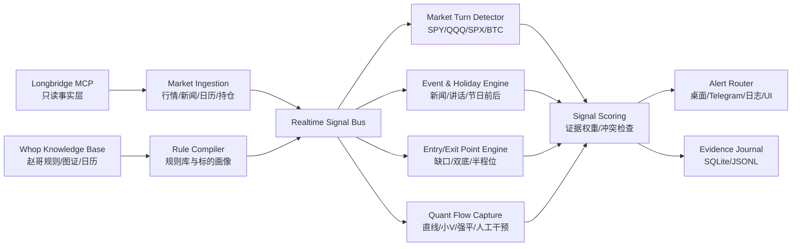

# Hermes Real-Time Alert Engine Design

本方案把当前 Whop xiaozhaolucky 知识库和本地 Longbridge MCP 接起来，目标是做一个只读、可审计、实时提醒型交易助手。系统负责发现大盘转弯、节假日/新闻/资金流触发点、特殊标的买卖观察位和量化交易窗口；不自动下单，不给无证据的买卖结论。

## 目标

- 实时预警提醒：盘前、夜盘、盘中、尾盘，按不同交易时段推送不同类型提醒。
- 大盘转弯提醒：重点跟踪 `SPY`、`QQQ`、`.SPX`、`BTC`、布伦特原油等母信号。
- 买入/卖出观察位：把知识库中的缺口、双底、半程位、前高、整数位、节假日低点转成候选点位。
- 截获量化交易买入时机：识别直线下杀、小 V、二次探底不破、3:00-3:30 强平结束、夜盘/盘前人工干预等模板。
- 综合事件驱动：节假日、美股新闻、法案投票、特朗普/黄仁勋/美联储讲话、地缘政治、月末养老金/基金再平衡。
- 特殊标的分析：第一批重点覆盖 `TSLL`、`NVDL`、`MSFT/MSFL`、`CONL`、`CIFR`、`IREN`、`HOOD`、`CRWV`、`BMNR`、`AMZU`、`GGLL`。

## 已有资产

### Longbridge MCP

当前仓库已经提供只读 MCP 服务，暴露在 `http://127.0.0.1:8765/mcp`。可用工具包括：

- 账户和持仓：`get_account_assets`、`list_stock_positions`
- 自选和股票池：`get_watchlist`、`set_universe`、`get_universe`
- 实时行情：`get_realtime_quote`、`get_realtime_quote_batch`
- 高频本地读：`subscribe_quotes`、`get_latest_quotes`
- K 线：`get_candles`
- 资金事实：`get_capital_flow`、`get_capital_distribution`
- 新闻和基本面：`get_symbol_news`、`get_fundamentals_summary`、`get_analyst_ratings`
- 交易日历：`get_market_calendar`
- 价格提醒事实：`get_price_alerts`

约束：当前 MCP 是事实层和证据层，不做下单，不暴露 `submit_order`、`replace_order`、`cancel_order`。

### Whop 知识库

知识库位于 `data/whop_archive/knowledge/`，关键输入：

- `messages_canonical.jsonl`: xiaozhaolucky 规范化历史发言。
- `trading_theory.md`: 已沉淀理论，包括仓位分层、缺口、节假日、日内时间窗、新闻事件、AI 硬件链等。
- `ticker_index.md`: 标的维度索引。
- `market_calendar.md`: 美股节假日与提前收盘基准。
- `image_meanings.md`: 图片含义沉淀。
- `image_verification_status.md`: 图片落地和真图复核状态。
- `channel_map.md`: 群组职责。

讨论群口径：只把 `xiaozhaolucky` 本人的原话当主证据，其他人发言最多作为上下文触发背景。

## 总体架构



推荐新增一个上层服务：`Hermes Alert Engine`。它通过 MCP 调用长桥事实，不直接依赖 Longbridge SDK。这样底层 MCP 继续保持纯净只读，上层引擎专门做信号、评分、提醒和复盘。

## 核心模块

### 1. Universe Builder

输入：

- Longbridge `get_watchlist`
- Longbridge `list_stock_positions`
- 本地手动 universe
- 知识库高频标的：`TSLL`、`NVDL`、`CONL`、`CIFR`、`IREN`、`HOOD`、`CRWV`、`BMNR`、`AMZU`、`MSFT/MSFL`

输出：

- `core_indices`: `SPY.US`、`QQQ.US`、`.SPX.US` 或 Longbridge 支持的 SPX 指数符号
- `crypto_proxies`: `BTC` 相关、`CONL`、`CIFR`、`IREN`、`BMNR`
- `ai_hardware`: `NVDA`、`NVDL`、`TSLL`、`MSFT/MSFL`、`MU`、`LITE`、`CRWV`
- `leveraged_etf`: `TSLL`、`NVDL`、`CONL`、`AMZU`、`GGLL`、`MSFL`

### 2. Market Turn Detector

这是系统主信号，不先猜新闻，先看大盘和母资产转弯。

实时数据：

- `get_latest_quotes` 高频读
- `get_candles(symbol, "1m", 120)`
- `get_candles(symbol, "5m", 120)`

信号：

- `straight_drop`: 3 分钟跌幅达到阈值，例如 `SPY -0.9%`、`QQQ -1.0%`，并且 1m K 线连续下压。
- `sharp_v`: 下杀后 1-3 根 1m K 线快速拉回，价格重新站回短均线。
- `second_probe_hold`: 二次探底不破前低，低点抬高或等同整数位。
- `first_turn_down_after_rally`: 从低位急拉到目标区后第一次向下转弯，用于减仓提醒。
- `integer_low`: `SPY 680.000` 这类无小数/整数字低点，作为转折观察位。

输出提醒示例：

```json
{
  "type": "market_turn",
  "symbol": "SPY.US",
  "level": "watch",
  "reason": "3m sharp V after straight drop; second probe did not break prior low",
  "candidate_action": "observe_entry",
  "evidence": ["1m candles", "knowledge: second_probe_hold", "session: regular"]
}
```

### 3. Entry/Exit Point Engine

把知识库里的点位规则变成候选价位，而不是简单喊买卖。

规则族：

- 缺口位：上方缺口作为减仓/阻力，下方缺口作为确认/回补观察。
- 双底与 `double_bottom * 0.98`：剩余 2-3 成资金优先堆在双底或双底折扣区。
- 半程位：高点与低点的一半，适用于 `TSLL`、`APLD`、`CRWV`、太空股等波动股。
- 前高位：半程位先减一半，前高附近再减剩余。
- 死拿仓目标：例如 `TSLL` 半程位 `20`，前高 `23.62`，派息后需要调整。
- 日内转弯减仓：低吸仓不是看赚几个点，而是看指数从低位拉到目标区后的第一脚转弯。

点位计算：

```text
halfway = (swing_high + swing_low) / 2
double_bottom_discount = prior_low * 0.98
gap_retest_zone = [gap_low, gap_high]
leveraged_etf_adjusted_target = raw_target - dividend_adjustment
```

对每个点位保存证据：

- 来源消息 ID
- 来源图片 asset key
- 计算公式
- 最新行情时间
- 是否接近节假日/讲话/财报

### 4. Quant Flow Capture

目标是抓赵哥反复说的量化资金窗口。

时间窗：

- 夜盘和盘前：重点看直线异动、人工干预、新闻发酵。
- 北京时间 `19:00`: 观察人工干预反弹窗口。
- 美股开盘前 30-60 分钟：被动减持日的冲高减仓窗口。
- 美股 `3:00-3:30 PM ET`: 强平结束、小 V 吸回窗口。
- 每小时窗口：`10:30`、`11:30`、`12:30`、`3:30` 附近的程序化急跌急涨。

识别逻辑：

- `linear_move_score`: 短时间斜率、成交量放大、连续同向 1m K。
- `forced_liquidation_score`: 尾盘单边下压后突然 V 回，且处于周五/月末/节前。
- `program_sweep_score`: 在固定时间窗内出现急跌急涨。
- `artificial_intervention_score`: 夜盘/盘前某固定时间突然直线拉升或回落。

### 5. Event & Holiday Engine

事件输入：

- `get_market_calendar("US", date)`
- `market_calendar.md`
- `get_symbol_news(symbol, limit, since)`
- 重要标的新闻：`NVDA`、`TSLA`、`MSFT`、`HOOD`、`COIN`、`BTC` 相关、`LITE`、`MU`
- 宏观/政策关键词：Trump、Iran、Hormuz、tariff、Fed、Powell、GTC、Jensen、stablecoin、MSCI、BOJ、holiday

节假日规则：

- 节前现金要求可能高于真实赎回，节后有多余现金回补。
- 一年约 10 个常规节日前后窗口，要提前进入日历。
- 节日前三天、节后第一天、月末周五、提前收盘日分别标注。
- 节日尾盘抄底后的第一天，第一波冲高先兑现，剩余看第二次转弯。

新闻规则：

- 原帖/原文优先于二手标题。
- 特朗普措辞从强硬转软，例如 `two or three weeks`，可作为风险缓和证据。
- 黄仁勋讲话中提到销量、需求、资本开支时，AI 硬件链容易发生量化扫单。
- 布伦特原油在战争/利率阶段作为风险先行指标，油价未掉头时大盘更难稳。

### 6. Special Stock Playbooks

#### TSLL

- 类型：特斯拉双倍 ETF，高 beta，适合拆分死拿仓和做 T 仓。
- 母信号：`TSLA`、`SPY`、`QQQ`、节前被动减持。
- 规则：半程位和前高位分层；派息日需要做价格校正；低位仓和做 T 仓分开。
- 提醒：
  - 接近历史低吸区/双底区：`watch_entry`
  - 接近半程位：`trim_half`
  - 高点转弯：`trim_tactical`

#### NVDL

- 类型：英伟达双倍 ETF，AI 硬件链核心。
- 母信号：`NVDA`、`QQQ`、黄仁勋/GTC、Leo KoGuan 加仓、硬件链新闻。
- 规则：夜盘/讲话直线拉升先减做 T；死拿仓看 AI 核心资产外部资金证据。

#### MSFT / MSFL

- 类型：微软正股/双倍，偏大盘科技核心。
- 母信号：`MSFT` 新闻、AI/云、`QQQ`、缺口。
- 规则：缺口回补和前高突破为主；双倍 ETF 要校正派息、杠杆衰减。

#### CONL

- 类型：Coinbase 双倍，币股联动。
- 母信号：`BTC`、稳定币法案、`COIN` 新闻、成交额。
- 规则：BTC 九转/成交额从预警到确认；若稳定币利空未修正，降低仓位级别。

#### CIFR / IREN / BMNR

- 类型：币股/矿股/ETH 资金线。
- 母信号：`BTC`、`ETH`、成交额、法案、资金披露。
- 规则：等双底、二次确认、关注度退潮和大盘转弯重合；不越跌越买。

## Signal Scoring

每条提醒按证据分层：

```text
base_score =
  market_turn_score * 0.30 +
  point_match_score * 0.20 +
  time_window_score * 0.15 +
  event_score * 0.15 +
  capital_flow_score * 0.10 +
  stock_playbook_score * 0.10
```

提醒等级：

- `info`: 新闻、日历、事件即将发生。
- `watch`: 接近关键点位或时间窗，还没转弯。
- `setup`: 点位、时间窗、母信号至少两项共振。
- `trigger`: 出现小 V、二次探底不破、第一脚转弯等执行信号。
- `risk`: 新闻冲突、跌破失效位、回踩确认失败、杠杆 ETF 派息/衰减风险。

冲突检查：

- 大盘未转弯时，个股低吸信号降级。
- 新闻强风险未缓和时，夜盘冲高更偏减仓。
- 节前被动减持期，盘中早补信号降级，尾盘强平小 V 升级。
- 月末养老金再平衡日，高位追涨信号降级。

## Alert Payload

提醒必须带证据，不发空泛结论。

```json
{
  "id": "alert_20260402_0932_spx_gap_retest",
  "level": "setup",
  "symbol": "SPY.US",
  "theme": "gap_retest_and_forced_liquidation",
  "candidate_action": "wait_for_turn",
  "price_zone": {
    "entry_watch": [6400, 6454],
    "trim_watch": [6540, 6583],
    "invalid_below": 6330
  },
  "why_now": [
    "SPX approaching prior gap lower edge",
    "holiday passive selling window",
    "knowledge rule: wait for 3:00-3:30 forced liquidation V"
  ],
  "evidence": [
    "Longbridge get_candles SPY.US 1m",
    "knowledge image file_cpR09zWdCWFAG",
    "knowledge image file_mAjpMHsgxjVdd"
  ],
  "as_of": "2026-04-02T13:32:00Z"
}
```

## Runtime Flow

### Pre-market

1. Load calendar: regular day, holiday-adjacent day, early close, monthly/quarterly window.
2. Pull news for core universe.
3. Compute overnight and premarket high/low.
4. Emit gap/holiday/event setup alerts.

### Regular session

1. Subscribe to core universe quotes.
2. Poll latest quotes every 3-5 seconds.
3. Refresh 1m candles every 15-30 seconds.
4. Run turn detector and quant-flow detector.
5. When a trigger appears, attach point engine and playbook context.

### Last 90 minutes

1. Raise weight for forced liquidation, passive selling, rebalance, option settlement.
2. Watch `3:00-3:30 PM ET` for small V and direct-line reversal.
3. Distinguish `trim first rally` from `enter after second probe`.

### Post-market / Night session

1. Watch artificial intervention windows and news fermentation.
2. For leveraged ETFs and high beta names, prioritize trim alerts on straight-line rallies.
3. Keep overnight lows as next-day second-probe references.

## Storage

建议继续用 SQLite，新增表：

```sql
create table signal_snapshot (
  id text primary key,
  created_at text not null,
  symbol text not null,
  signal_type text not null,
  score real not null,
  payload_json text not null
);

create table alert_event (
  id text primary key,
  created_at text not null,
  level text not null,
  symbol text,
  title text not null,
  body text not null,
  payload_json text not null,
  acknowledged_at text
);

create table rule_evidence (
  id text primary key,
  rule_key text not null,
  source_file text not null,
  source_id text,
  evidence_text text not null,
  symbols_json text not null
);
```

## Implementation Plan

### Phase 1: Evidence-backed alert prototype

- Add a local `alert-rules.json` generated from `trading_theory.md`, `ticker_index.md`, and `image_meanings.md`.
- Build a small runner that calls MCP tools and emits JSON alerts.
- Cover only `SPY`、`QQQ`、`TSLL`、`NVDL`、`CONL` first.
- Output to local `data/alerts/alert_events.jsonl`.

### Phase 2: Realtime scheduler

- Add quote subscription for core universe.
- Add 1m candle polling and V-turn detection.
- Add market session awareness using `get_market_calendar`.
- Add alert dedupe and cooldown.

### Phase 3: News and event engine

- Pull symbol news and keyword news.
- Parse event keywords into `event_score`.
- Add day-level tags: holiday-adjacent, month-end, Friday, quarter-end, earnings, speech.

### Phase 4: Special stock playbooks

- Encode per-symbol playbooks for `TSLL`、`NVDL`、`MSFT/MSFL`、`CONL`、`CIFR`、`IREN`、`HOOD`、`CRWV`、`BMNR`。
- Add leveraged ETF dividend adjustment warning.
- Add BTC/ETH proxy gating for crypto stocks.

### Phase 5: Dashboard and notifications

- Dashboard: current market state, active setups, trigger history, evidence trace.
- Notifications: macOS notification, Telegram, email, or webhook.
- Every alert should link back to evidence IDs in the knowledge base.

## Guardrails

- 只做提醒和观察位，不自动下单。
- 所有提醒必须附带证据、时间、价格、数据新鲜度。
- 数据过期、Longbridge 返回 warning、行情缓存太旧时，提醒自动降级。
- 杠杆 ETF 必须提示派息、隔夜、衰减和母资产偏离风险。
- 讨论区只用 `xiaozhaolucky` 本人原话沉淀规则。
- 不把单条新闻当作交易结论，必须和盘口/转弯/时间窗至少一项共振。

## First Concrete Alert Set

第一版建议先做 12 类提醒：

1. `SPY/QQQ 3m straight drop`
2. `SPY/QQQ sharp V`
3. `second probe did not break`
4. `first turn down after rally`
5. `3:00-3:30 forced-liquidation V`
6. `holiday passive-selling window`
7. `gap retest near 6400/6454/6540 style levels`
8. `BTC nine-turn and turnover confirmation`
9. `Brent oil risk-on/risk-off switch`
10. `Trump/Fed/Jensen speech window`
11. `leveraged ETF dividend adjustment`
12. `special-stock playbook trigger`

这个集合可以覆盖当前知识库里最稳定、重复次数最多、也最适合实时化的规则。
